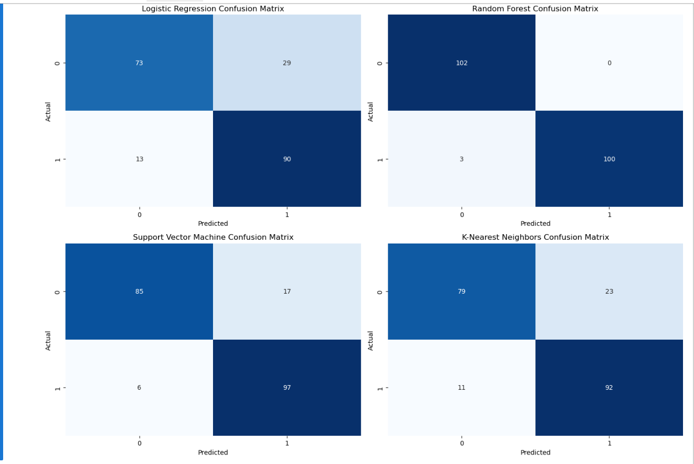
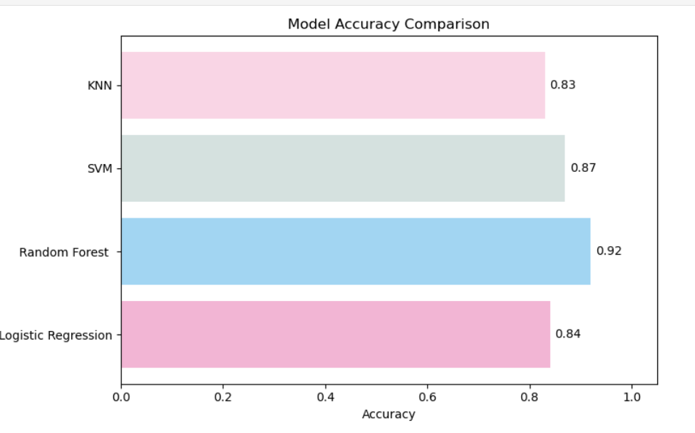
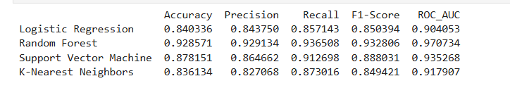

#  Heart Disease Prediction using Machine Learning

> Developed by: **Sk. Zaafira Yumn**, **M.NARENDRA KUMAR**, **NSK. SAI KARTHIK**  
> B.Tech – Computer Science (Artificial Intelligence & ML)  
> [VIT - AP ], [4th Semester]

This project uses supervised machine learning to predict the presence of heart disease in patients based on clinical features. It was developed as a group project by students of Computer Science & Engineering (Artificial Intelligence & Machine Learning).

---

##  Dataset

We used the  [UCI Heart Disease Dataset](heart_statlog_cleveland_hungary_final.xls), which includes 14 clinical attributes like:

- Age  
- Sex  
- Chest pain type (cp)  
- Resting blood pressure (trestbps)  
- Serum cholesterol (chol)  
- Fasting blood sugar (fbs)  
- Resting electrocardiographic results (restecg)  
- Max heart rate achieved (thalach)  
- Exercise-induced angina (exang), etc.

---

##  Machine Learning Approach

- **Model Used**: Logistic Regression, RandomForest,SVM, K-NearestNeighbor
- **Preprocessing**: StandardScaler  
- **Train/Test Split**: 80/20  
- **Evaluation**: Accuracy, Precision, Recall, F1-Score, Confusion Matrix

---

##  Workflow

1. Load and clean the dataset  
2. Perform exploratory data analysis (EDA)  
3. Encode categorical variables  
4. Normalize data  
5. Train ML model  
6. Evaluate and visualize performance  
7. Save trained model for future use

---

##  Results

| Model                | Acuuracy |Precision | Recall |F1 Score|
|----------------------|--------- |----------|--------|--------|
|Logistic Regression   |  0.84    |  0.84    | 0.85   |   0.85 |
|Random Forest         |  0.92    |  0.92    | 0.93   |   0.93 |
|Support Vector Machine|  0.87    |  0.86    | 0.91   |   0.88 |
|K-Nearest Neighbors   |  0.8     |  0.82    | 0.87   |   0.84 |

---

##  Visualizations

### Confusion Matrix  

### Accuracy Graph  

### Evaluation Matrix

---

